# 💳 Native Wallet

> **AI-powered personal finance and expense tracking app built with React Native.**

Native Wallet is a modern expense tracking application designed to make personal finance management **simple, fast, and intelligent**.

Instead of manually entering every transaction, users can add income and expenses in multiple ways — **manually, by scanning a receipt/invoice, or simply by speaking to the AI**. The built-in AI assistant can also answer questions about spending, income, budgets, and recent financial activity, while providing suggestions to help users save money.

---

## 📱 Try Native Wallet

<p align="center">
  <a href="https://expo.dev/accounts/mrudul_gauba/projects/native-wallet/builds/3f802b52-7b09-4cff-9aff-e95cc1a67607">
    
  </a>
</p>

<p align="center">
  <b>Experience Native Wallet directly on your Android device.</b><br>
  Download the latest Android build and try the app yourself.
</p>

> ⚠️ **Android only:** This is a development/local build distributed through Expo EAS and is not currently available on the Google Play Store.
>
> Android may ask for permission to install an application from an external source when installing the APK.

---

---

## ✨ Features

### 🤖 AI-Powered Finance Assistant

- Ask questions about your income, expenses, spending habits, and budgets.
- Get insights based on recent financial activity.
- Ask questions such as:
  - _"How much did I spend on food this month?"_
  - _"What's my biggest expense this week?"_
  - _"Am I over budget anywhere?"_
- Get AI-powered suggestions for reducing unnecessary spending and saving money.

### 🎙️ AI Voice Logging

Add transactions without typing.

Simply describe a transaction naturally, for example:

> "I spent ₹400 on groceries yesterday."

The AI processes the voice input and can extract the relevant transaction details for logging.

### 📷 Receipt & Invoice Scanning

- Scan a receipt or invoice using the device camera.
- Use AI to extract transaction information.
- Reduce the amount of manual data entry required.

### ✍️ Manual Transaction Entry

Users can manually record:

- Income
- Expenses
- Amount
- Category
- Account
- Date
- Optional description

Transactions can be categorized into areas such as:

- 🍔 Food & Dining
- 🛒 Groceries
- 🚗 Transport
- 🛍️ Shopping
- ✈️ Travel
- 🏠 Utilities
- 💼 Salary
- 📈 Investment
- 💻 Freelance
- And more

### 💰 Multiple Accounts

Track balances across multiple financial accounts from one place.

Examples include:

- Bank accounts
- Savings accounts
- Credit cards
- Wallet/cash
- Other custom accounts

Each account maintains its own balance and can be selected while recording a transaction.

### 📊 Financial Dashboard

The home dashboard provides a quick overview of:

- Total balance
- Income
- Expenses
- Monthly budget
- Expense breakdown
- Recent transactions
- Category-wise spending

### 📈 Transaction Analytics

The Transactions section includes:

- Search
- Income / Expense filtering
- Account filtering
- Daily income vs expense visualization
- Complete transaction history
- Categorized transactions

### 📄 CSV Statement Export

Export the **last 30 days of transactions as a CSV file**.

This makes it easier to:

- Maintain personal financial records
- Keep offline backups
- Analyze spending externally
- Share transaction data when required

### 🔐 Authentication & Account Security

- Secure user authentication with Clerk.
- Email verification during account creation.
- Account sign-out.
- Secure account deletion workflow.
- Biometric app lock for an additional layer of privacy.
- Configurable biometric lock timing.

### 👤 Profile & Preferences

Users can manage:

- Profile information
- Profile picture
- Multiple accounts
- Default currency
- Biometric lock
- Lock timing preferences
- Account sign-out
- Account deletion

### 🎨 Clean Mobile UI

- Modern card-based interface
- Light/dark visual hierarchy
- Consistent category colors
- Bottom tab navigation
- Responsive mobile layout
- Focus on readability and quick interaction

---

# 📱 Screenshots

## Authentication & Onboarding

| Sign Up                           | Sign In                           |
| --------------------------------- | --------------------------------- |
| 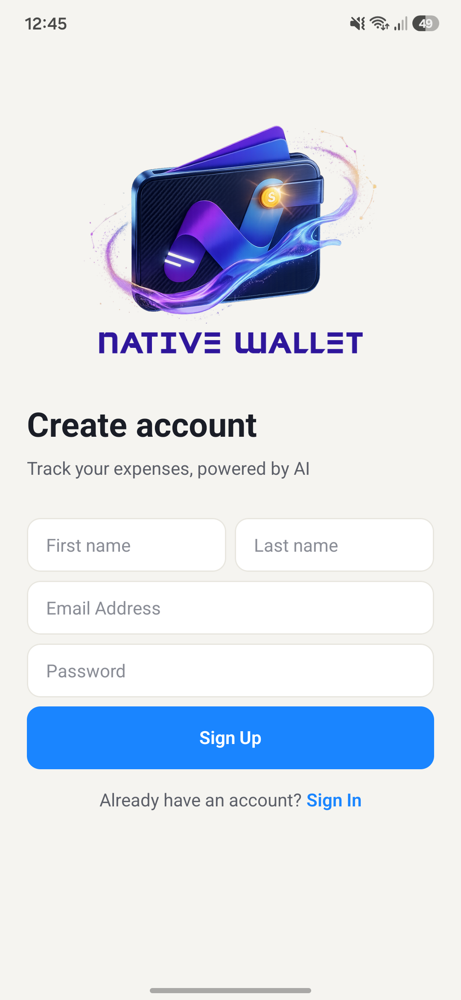 | 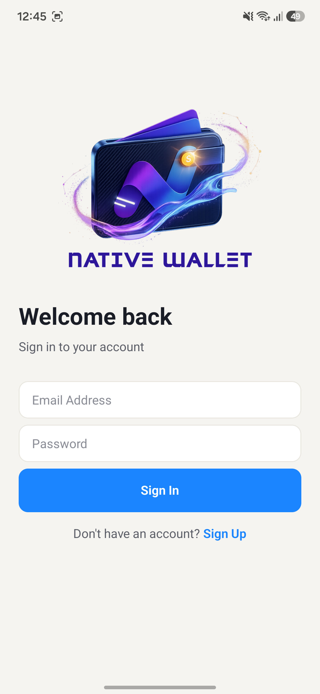 |

| Account Verification                           | Onboarding                           |
| ---------------------------------------------- | ------------------------------------ |
| 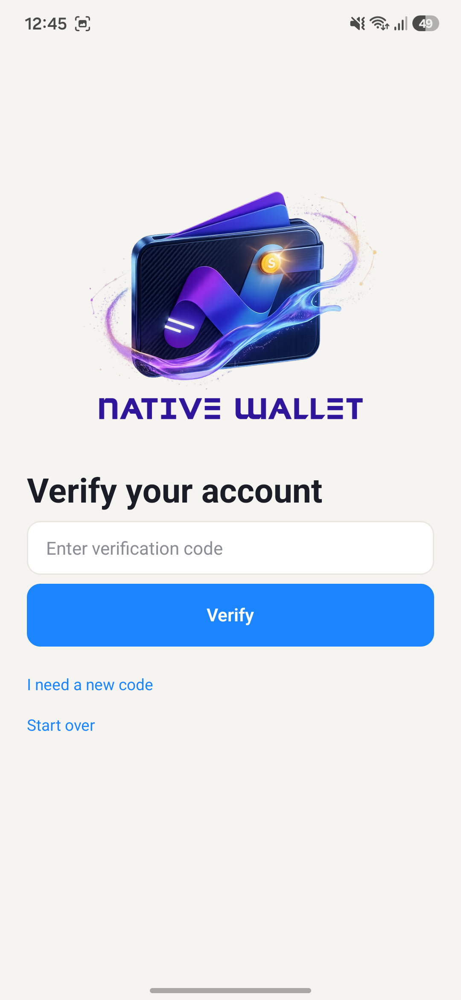 | 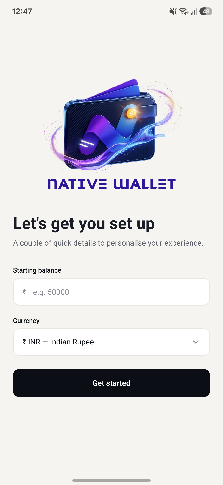 |

---

## 🏠 Home Dashboard

| Dashboard                                | Recent Transactions                           |
| ---------------------------------------- | --------------------------------------------- |
| 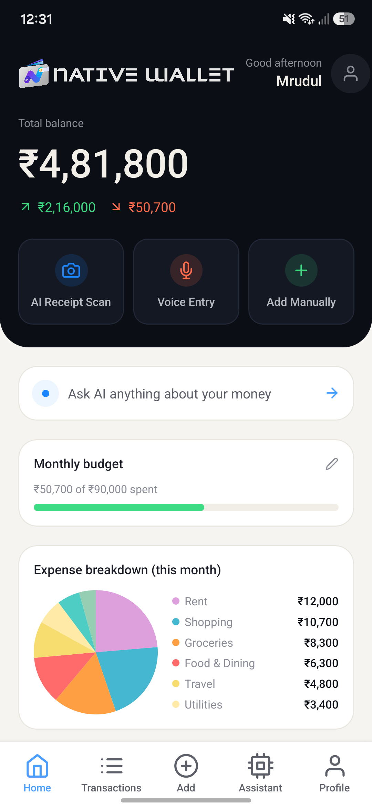 | 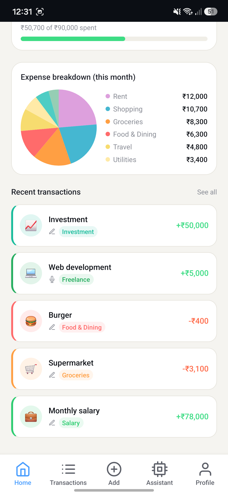 |

The dashboard provides a quick financial snapshot including balance, income, expenses, budget progress, expense distribution, and recent activity.

---

## 💳 Transactions

### Transactions Overview

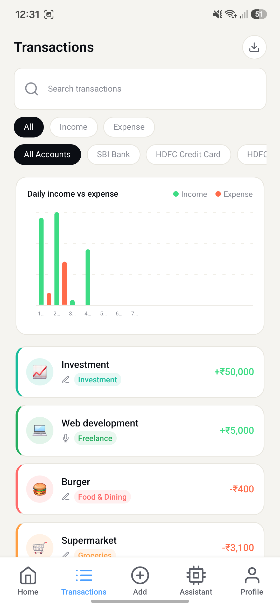

### Transaction History

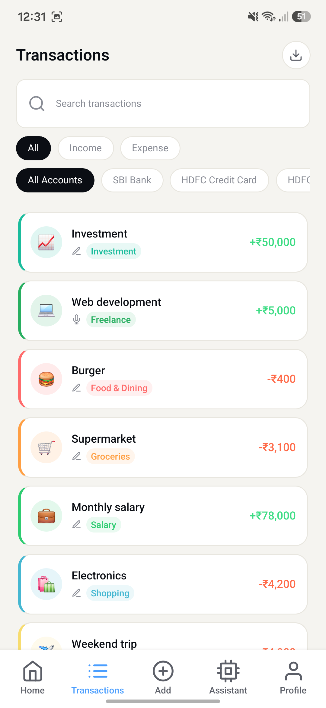

Transactions can be searched and filtered by type and account, with visual analytics for daily income and expenses.

---

## ➕ Add Transactions

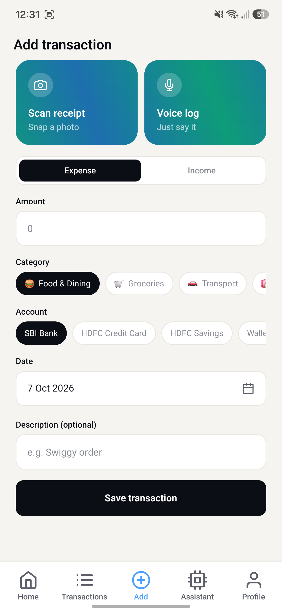

Users can manually record income or expenses and select the appropriate amount, category, account, date, and description.

---

## 🤖 AI Voice Logging

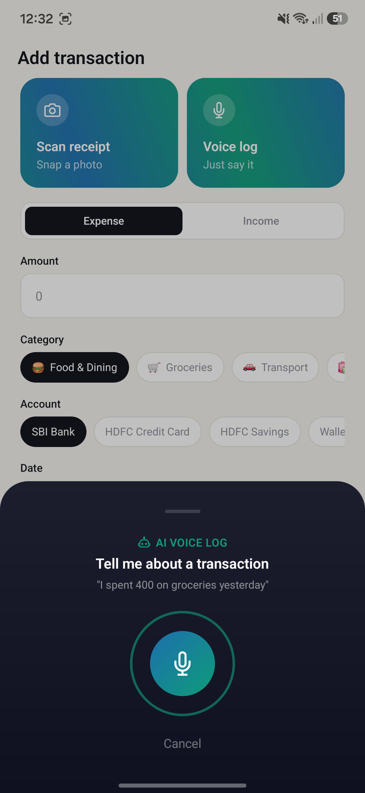

Instead of filling out a form, users can simply describe a transaction naturally and let the AI interpret it.

---

## 🧠 AI Financial Assistant

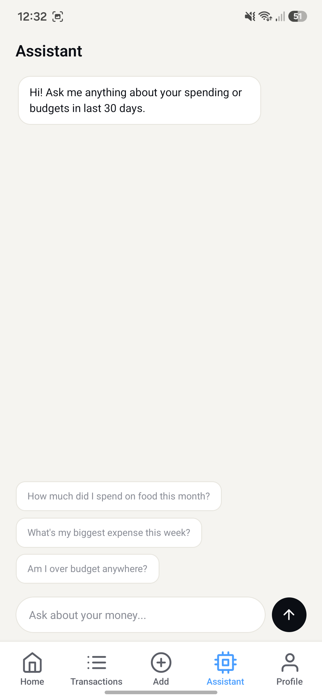

The assistant can answer questions about the user's recent financial activity and help identify spending patterns and potential savings opportunities.

---

## 👤 Profile & Account Management

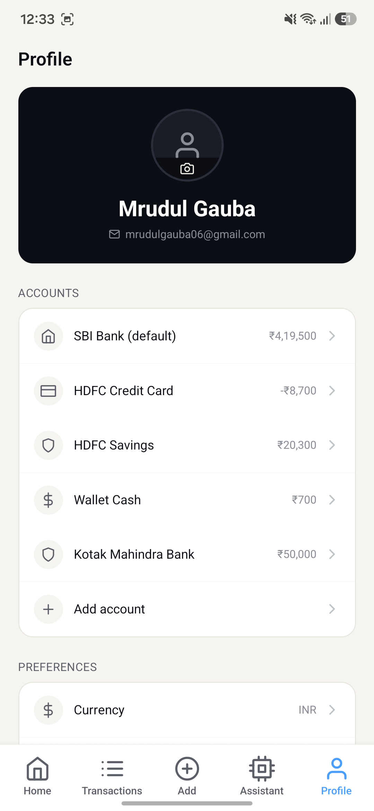

Users can manage multiple accounts and view their current balances from the Profile section.

### Preferences & Security

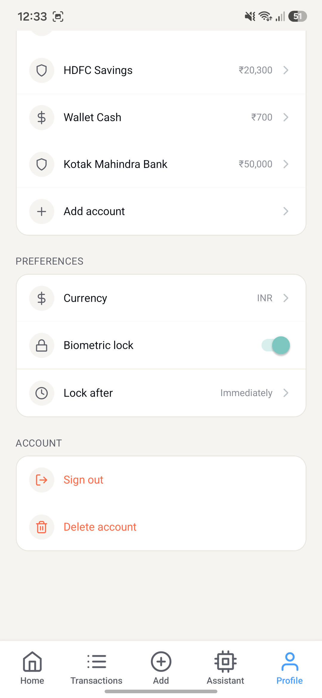

The Profile section also provides currency selection, biometric lock controls, lock timing, sign-out, and account deletion.

---

# 🛠️ Tech Stack

| Technology                    | Purpose                                                             |
| ----------------------------- | ------------------------------------------------------------------- |
| **React Native**              | Cross-platform mobile application                                   |
| **Expo**                      | Development workflow and native tooling                             |
| **Expo Go**                   | Development and device testing                                      |
| **Expo Router**               | File-based navigation                                               |
| **TypeScript**                | Type-safe application development                                   |
| **Supabase**                  | Backend, database, and server-side functionality                    |
| **Clerk**                     | Authentication and user identity management                         |
| **Google Gemini API**         | AI-powered finance assistant, voice/receipt processing and insights |
| **React Hook Form**           | Form state management                                               |
| **Zod**                       | Input/schema validation                                             |
| **Expo Local Authentication** | Biometric authentication                                            |
| **CSV Export**                | 30-day transaction statement export                                 |

---

# 🏗️ Application Architecture

At a high level, Native Wallet follows this flow:

```text
                    ┌─────────────────────┐
                    │    Native Wallet    │
                    │   React Native App  │
                    └──────────┬──────────┘
                               │
             ┌─────────────────┼─────────────────┐
             │                 │                 │
             ▼                 ▼                 ▼
       ┌───────────┐     ┌────────────┐    ┌─────────────┐
       │   Clerk   │     │  Supabase  │    │   Gemini    │
       │   Auth    │     │  Backend   │    │     AI      │
       └───────────┘     └────────────┘    └─────────────┘
             │                 │                 │
             ▼                 ▼                 ▼
        User Identity      Transactions      AI Insights
        & Verification     & Accounts       & Processing
```

### Authentication

**Clerk** handles:

- Sign up
- Sign in
- Email verification
- Session management
- User identity

### Backend

**Supabase** handles application data such as:

- Users
- Accounts
- Transactions
- Categories
- Budgets
- Other financial records

### AI

**Gemini** powers the intelligent parts of the application, including:

- Financial questions
- Spending analysis
- Saving suggestions
- Voice transaction interpretation
- Receipt/invoice understanding

---

# 🔄 Core User Flows

## 1. Create an Account

```text
Sign Up
   ↓
Email Verification
   ↓
Set Starting Balance
   ↓
Select Currency
   ↓
Dashboard
```

## 2. Add a Transaction Manually

```text
Add Transaction
      ↓
Income / Expense
      ↓
Amount
      ↓
Category
      ↓
Account
      ↓
Date + Description
      ↓
Save Transaction
```

## 3. Add a Transaction with Voice

```text
AI Voice Log
     ↓
Speak Transaction
     ↓
AI interprets the input
     ↓
Transaction details extracted
     ↓
Transaction logged
```

## 4. Analyze Finances

```text
User asks a question
        ↓
AI Assistant
        ↓
Relevant financial data
        ↓
AI analysis
        ↓
Answer / Insight / Saving suggestion
```

---

# 🚀 Getting Started

## Prerequisites

Make sure you have the following installed:

- Node.js
- npm
- Expo CLI / Expo tooling
- Expo Go on a physical device (for development)
- A Clerk account
- A Supabase project
- A Google Gemini API key

---

## Installation

Clone the repository:

```bash
git clone https://github.com/mrudul-gauba/Native-Wallet-v2.git
cd native-wallet
```

Install dependencies:

```bash
npm install
```

Start the Expo development server:

```bash
npx expo start
```

Then scan the QR code using **Expo Go** or run the application on an available emulator/simulator.

---

# 🔑 Environment Variables

Create a `.env` file in the project root.

The exact variable names should match the ones used in your implementation. A typical setup may look like:

```env
EXPO_PUBLIC_CLERK_PUBLISHABLE_KEY=your_clerk_publishable_key
EXPO_PUBLIC_SUPABASE_URL=your_supabase_url
EXPO_PUBLIC_SUPABASE_ANON_KEY=your_supabase_anon_key

# Gemini key / server-side AI configuration
GEMINI_API_KEY=your_gemini_api_key
```

> ⚠️ **Never commit API keys, service-role keys, or other secrets to GitHub.**
>
> For production, sensitive Gemini credentials should be kept on a trusted server-side environment (for example, a Supabase Edge Function) rather than exposed directly in the client application.

Add your environment file to `.gitignore`:

```gitignore
.env
.env.*
```

---

# 🗄️ Backend Setup

Create a Supabase project and configure the required database tables used by the application.

The database should contain the application's core financial data, including users, accounts, and transactions.

Clerk user identity is used to associate authenticated users with their application data.

> **Important:** Keep Row Level Security (RLS) enabled and ensure users can only access their own financial records.

---

# 🔐 Security Considerations

Native Wallet deals with personal financial information, so security is an important part of the application.

The application uses:

- Clerk authentication
- Authenticated user sessions
- Supabase database access
- Row Level Security where applicable
- Biometric app locking
- Secure account deletion
- Environment variables for secrets

### API Keys

Never commit:

```text
GEMINI_API_KEY
SUPABASE_SERVICE_ROLE_KEY
Other private credentials
```

to a public repository.

Only public client-side keys that are intentionally safe for client use should be exposed through the mobile application.

---

# 📂 Suggested Project Structure

```text
native-wallet/
│
├── app/
│   ├── (auth)/
│   │   ├── sign-in.tsx
│   │   ├── sign-up.tsx
│   │   └── verify.tsx
│   │
│   ├── (onboarding)/
│   │
│   ├── (tabs)/
│   │   ├── index.tsx
│   │   ├── transactions.tsx
│   │   ├── add.tsx
│   │   ├── assistant.tsx
│   │   └── profile.tsx
│   │
│   └── _layout.tsx
│
├── components/
│   └── ...
│
├── constants/
│   ├── categories.ts
│   └── theme.ts
│
├── lib/
│   └── ...
│
├── supabase/
│   └── functions/
│       └── ...
│
├── assets/
│   └── images/
│
├── screenshots/
│   └── ...
│
├── app.json
├── package.json
├── tsconfig.json
└── README.md
```

> The structure above is a representative structure. Adjust it to match the actual repository structure if folders/files differ.

---

# 📊 What Native Wallet Solves

Traditional expense trackers often require users to manually enter every transaction.

Native Wallet focuses on reducing that friction:

| Traditional Approach        | Native Wallet                   |
| --------------------------- | ------------------------------- |
| Manually type every expense | Manual, voice, or receipt input |
| Basic expense list          | Dashboard + analytics           |
| Static reports              | AI-powered financial questions  |
| Separate notes for spending | Centralized transaction history |
| Manual analysis             | AI spending insights            |
| Difficult record keeping    | 30-day CSV export               |
| Single account tracking     | Multiple accounts               |
| Basic app security          | Authentication + biometric lock |

---

# 🔮 Future Improvements

Potential future additions include:

- 📸 More advanced receipt OCR
- 🏦 Bank account synchronization
- 🔔 Budget alerts and notifications
- 📅 Recurring transactions
- 📈 More advanced financial analytics
- 💡 Personalized monthly saving plans
- 📊 More detailed spending reports
- ☁️ Automated cloud backups
- 🌍 More currencies and localization
- 📱 Production builds for Android and iOS
- 🤖 More advanced AI-powered financial recommendations

---

# 📱 Android Build

The Android version can currently be experienced through an **Expo EAS build**.

### Download the latest Android APK

**[👉 Download Native Wallet for Android](https://expo.dev/accounts/mrudul_gauba/projects/native-wallet/builds/3f802b52-7b09-4cff-9aff-e95cc1a67607)**

> ⚠️ This is a development/local build intended for testing and demonstration. It is not currently distributed through the Google Play Store.

---

# 🧪 Development

Native Wallet was developed and tested using **Expo Go** during the development process.

For production distribution, the project can be built using Expo's production build tooling and configured for the target Android/iOS platforms.

---

# ⚠️ Disclaimer

Native Wallet is a personal finance tracking and organization tool.

AI-generated insights and suggestions are intended for **informational purposes only** and should not be considered professional financial, investment, tax, or legal advice.

---

# 👨‍💻 Author

**Mrudul Gauba**

Built as a React Native personal finance application combining mobile development, cloud backend services, authentication, and generative AI.

---

## ⭐ If you like the project

If you find Native Wallet useful or interesting, consider giving the repository a ⭐ on GitHub.
